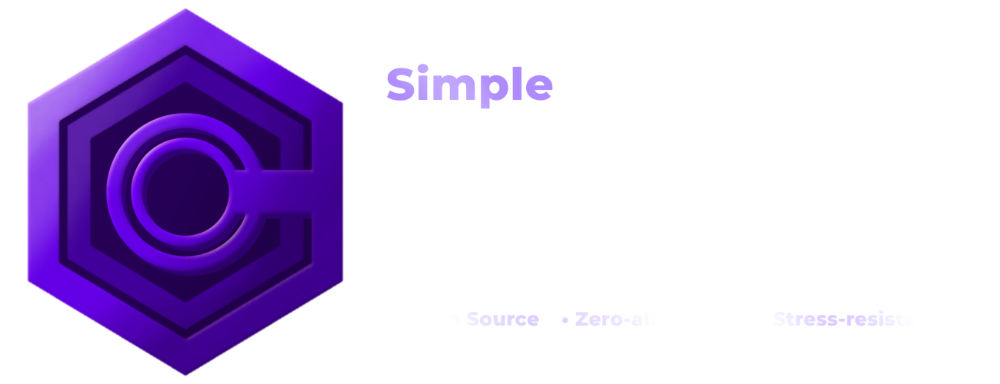

?style=flat&logo=sharp) ?style=flat&logo=dotnet) ?style=flat&logo=avaloniaui) ) ?style=flat)
?style=flat) ?style=flat)

**Remote Management Framework (Simple RMF)** is a high-performance, cross-platform tool for centralized monitoring and management of device fleets. The project combines convenient real-time console management with a modern .NET architecture designed for high-load environments.

## ⚙️ Architecture Overview

To maintain maximum performance when processing incoming client packets, the framework utilizes multiple abstraction layers: `OpenTCP -> ClientHandler -> ChannelDispatcher -> Channel<PacketContext> -> PacketProcessor`. This approach evenly distributes the load across isolated channels and prevents bottlenecks when handling thousands of concurrent requests from multiple clients.

## 🔥 Key Features

- **Zero-Allocation Architecture:** High-load nodes (e.g., packet deserialization, VRAM unloading) extensively use `ArrayPool`, `Unsafe`, and `Marshal`. This minimizes heap allocations, eliminates micro-stutters, and significantly reduces Garbage Collector overhead.

* **App Lifecycle & DI:** Built on top of the `.NET Generic Host` (`IHostBuilder`). The architecture leverages powerful Dependency Injection and guarantees true Graceful Shutdowns. Background services, network channels, and unmanaged UI threads are terminated sequentially and safely, preventing memory leaks and deadlocks.

- **Cross-Platform Screen Capture:** The agent automatically detects the OS and utilizes the optimal graphics API: **DXGI** for direct VRAM access on Windows, and **X11** or **Wayland** on Linux distributions. To ensure stream stability, if a client-side GPU failure occurs, the application safely drops corrupted frames without dropping the connection.

- **Built-in Firewall & TLS:** All communication between the server and clients is strictly encrypted using `SslStream`. The framework implements robust MITM protection by validating strict **TLS certificate** fingerprints on the client side before establishing any session.

- **Smart CLI (Inline Input):** An interactive server console with real-time command auto-completion and syntax highlighting.

* **Custom Logging & Auditing:** Features an isolated, allocation-friendly logging provider integrated directly into the server console. It supports automatic log rotation and file backups without blocking the main event loops.

- **Dynamic Configurations:** Utilizing XML configs in conjunction with Reflection allows for "on-the-fly" adjustments of constants and processor parameters without recompiling the core.

## 💽 Project Structure

- **Server (RMF-Server)** — The core of the system. Deployed on the administrator's machine. It uses a hybrid interface: primary control is handled via an optimized console, while a cross-platform GUI based on **Avalonia UI** is dynamically initialized for streaming client screens. It has no platform-dependent restrictions.

- **Client (RMF-Client)** — A lightweight endpoint running in the background on target corporate network machines. The agent automatically collects telemetry, adapts to the current OS, and awaits instructions from the server.

- **Core library (RMF.Core)** — A common set of tools provided by the library to support both parts of the project: network stream readers, adapters for listeners and network connections, and convenient context wrappers.

- **Unit/High-load tests (RMF.Tests)** — An independent part of the project required for unit testing the functionality and stability of the project's methods.

## 🔗 Tech Stack & Dependencies

- **Platform:** .NET 9.0 SDK.

- **Concurrency:** Asynchronous I/O, `ConcurrentDictionary<T>`, `Channel<T>` (Bounded/DropOldest mode).

* **Memory Management:** `ArrayPool<T>`, `Buffer`, `Marshal`, `Span<T>`, `Memory<T>`, `Unsafe`.

- **Supported OS:**

    - _Windows:_ **10, 11**.
    
    - _Linux:_ **Debian, Ubuntu, Arch, Fedora**, and other distributions with similar architecture.
        
- **NuGet Libraries:**

    - `Avalonia UI` — For rendering the cross-platform graphical interface on the server side.
    
    - `SkiaSharp` — For high-performance graphics processing and frame compression.

### 🚀 Installation and Launch

To compile the project, ensure that the target machines have the **.NET 9.0 SDK** (or higher) installed.

```bash
# Clone the remote repository
git clone https://github.com/BimbaXdeV/Simple-RMF.git
cd Simple-RMF

# Launch the server-side
cd RMF.Server
dotnet run

# Launch the client agent (can be run on the same machine for testing)
cd RMF.Client
dotnet run
```

For fine-tuning the system, it is highly recommended to explore the configuration files of both components. In addition to standard connection identifiers, you can adjust a multitude of operational parameters, ranging from visual appearance to logging behaviors.

> [!NOTE]
> The framework comes with pre-configured default settings, so you won't need to dig into complex configurations for your first test build. Feel free to build and run the project using the defaults; you can always tweak them later at any time.

## 🪪 License & Disclaimer

This project is licensed under the **MIT License**. See the `LICENSE.txt` file for details.

⚠️ **Disclaimer:** This software is created **exclusively for educational purposes and legitimate system administration**. The author is not responsible for any direct or indirect damages caused by the improper or illegal use of this tool. The user assumes full responsibility for complying with local laws and regulations when deploying this software.